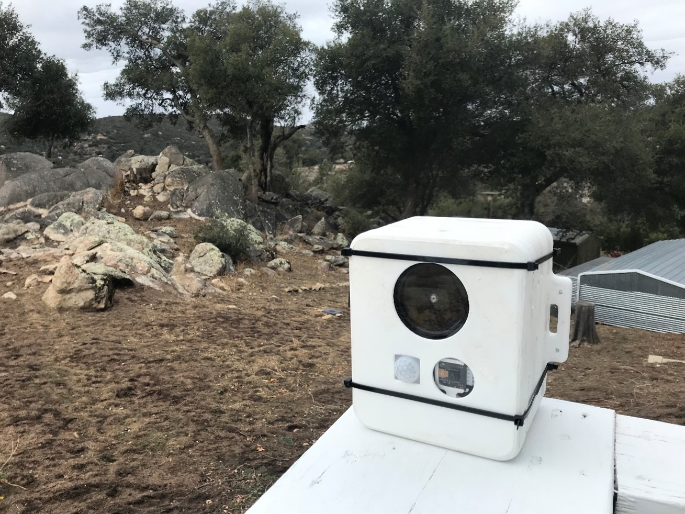
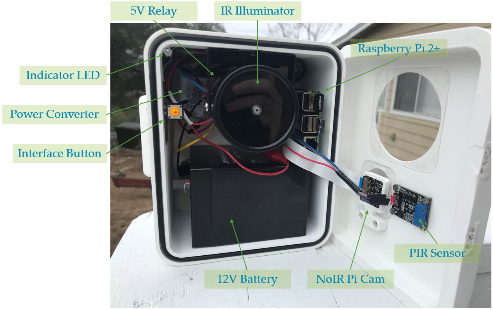

# Raspberry Pi Trap Camera

A custom Trap Camera that uses a Passive Infrared trigger to turn on an Infrared Illuminator and start taking photos via a camera with No IR Filter!

*Gray Fox caught in the act of going through my compost*

## Design

Parts List:
- Electronics
    - Raspberry Pi
    - Pi NoIR Camera
    - Passive IR Sensor
    - IR Illuminator
    - 12V Battery
    - Power Relay (GPIO Controllable)
    - 12V to 5V Power Converter
    - Button
    - LED
    - USB External Storage
- Mechanical
    - Polycarbonate Cutouts for Illuminator and Camera
    - O-Ring
    - Pins/ Rods for Hinges
    - Various Fasteners
    - Wiring

